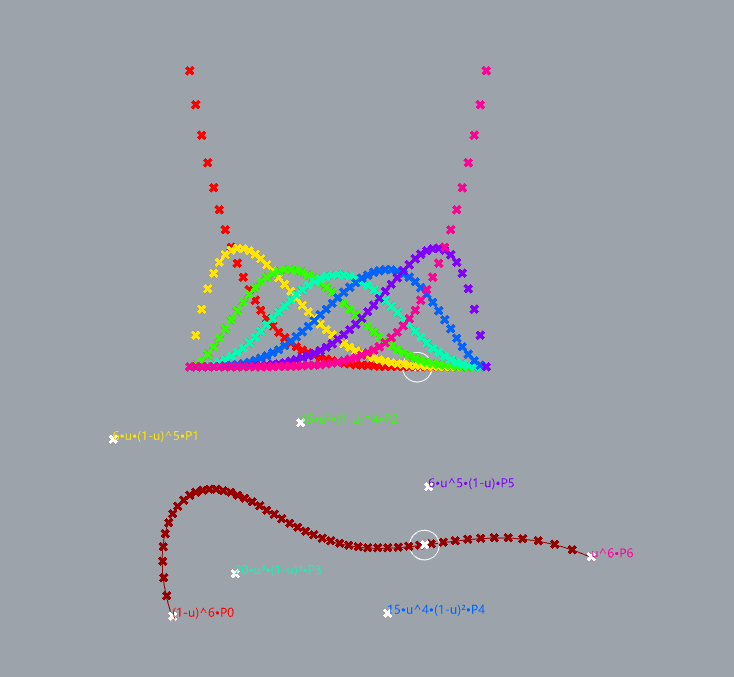

# De Boor's Algorithm for NURBS Curve

* verion 0.0.2  
* Copyright (c) 2019-2020 mahaidong
* github https://github.com/mahaidong
* Supported by ikuku.cn & caad.xyz 

### What is this?

De Boor's Algorithm for Nurbs.

Gaining an intuitive understanding for NURBS is difficult without directly seeing the effects of different control point position, weight vectors, and  knot vectors.

This grasshopper component allows you demonstrate NURBS curves by specifying the degree of the curve, control points, weight vector and the knot vector. 

This allows the user to see NURBS curves in its most general sense.

De Boor's Algorithm reference: https://pages.mtu.edu/~shene/COURSES/cs3621/NOTES/spline/de-Boor.html

### install and use

bezier curve

spline:

nurbs circle

* copy ghuser file to User Objects Folder
* open sample file  DeBoorAlgorithmNurbs.gh to see the result

### License

You can redistribute it and/or modify it under the terms of the GNU Lesser General Public License version 3 as published by the Free Software Foundation.
